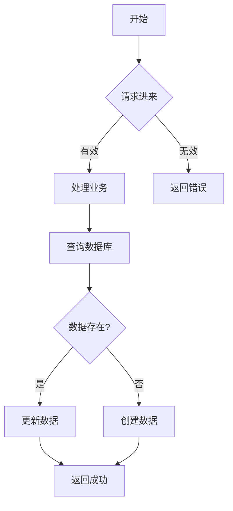
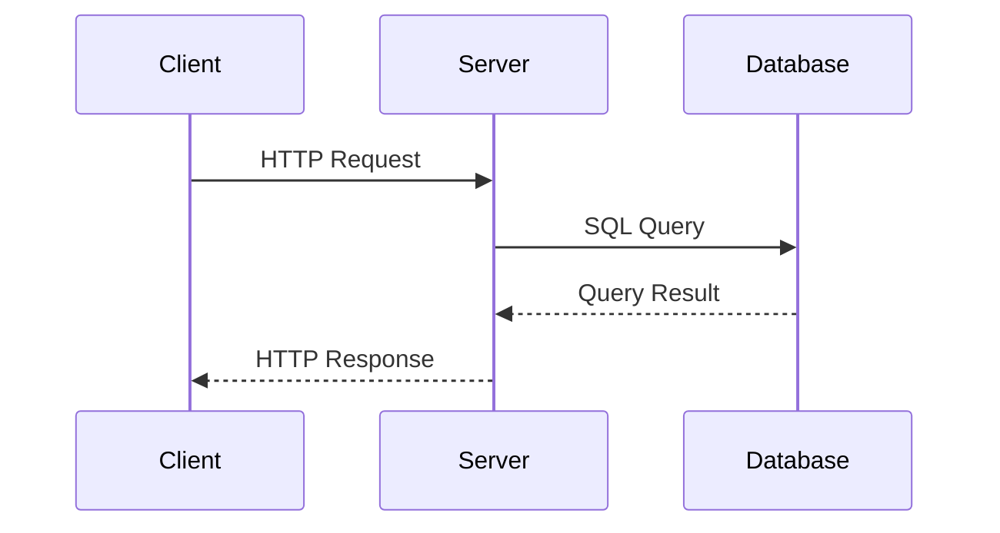

# my-skill

> Auto-synced from `~/.claude/skills` • Last updated: 2026/4/3 11:06:54

[📦 GitHub](https://github.com/Fenghaze/my-skill)

---

## `auto-upload-skill`

本地skill创建后自动上传到GitHub的自动化工具

### 启动同步服务

首次使用需要启动daemon：
```
node C:/Users/Administrator/.claude/skill-sync/daemon.js --daemon
```

建议使用 PM2 或 Windows任务计划程序保持后台运行。

### 查看同步状态

```
node C:/Users/Administrator/.claude/skill-sync/daemon.js
```

### 手动同步

手动触发所有skills的同步（不使用daemon）：
```
node C:/Users/Administrator/.claude/skill-sync/daemon.js
```

---

## `enhance-chat-skill`

增强型规划技能，使用设计树方法论进行严谨的软件设计

---

## `find-skill`

Helps users discover and install agent skills when they ask questions like "how do I do X", "find a skill for X", "is there a skill that can...", or express interest in extending capabilities. This skill should be used when the user is looking for functionality that might exist as an installable skill.

---

## `knowledge-review-skill`

"当用户希望回顾刚实现的功能、总结学习要点、分析设计思路或代码实现时触发。适用于'/review'、'帮我总结这个功能'、'讲解一下这段代码'、'回顾一下'等请求。此技能会根据用户对相关知识点的掌握程度定制化总结内容。"

### 阶段1：需求收集

**步骤1：确定回顾范围**
请用户提供想要回顾的内容（功能描述、代码片段或文件路径）。

**步骤2：识别相关知识点**
根据代码内容，列出涉及的知识点供用户选择。

**步骤3：评估掌握程度**
对于用户选中的每个知识点，询问掌握程度：
- 了解：听过概念，不清楚原理
- 熟悉：能基本使用，不了解底层
- 掌握：能熟练使用，了解原理
- 精通：能设计实现，了解源码

### 阶段2：定制化总结生成


### 阶段3：生成总结报告

**报告头部信息：**
```markdown
# 📚 知识回顾：{功能名称}

- **功能标题**：{用户描述的功能名称}
- **实现时间**：{YYYY年MM月DD日 HH:mm:ss}
- **涉及技术**：{技术栈列表}

---
```

**报告内容：**

1. **功能概述** - 简洁描述功能做了什么、为什么需要这个功能
2. **设计思路** - 采用了什么设计方案、为什么这样设计、解决了什么问题
3. **核心代码解析** - 按模块分析关键代码及其原理
4. **流程/时序图** - 使用 Mermaid 格式生成实现流程图或时序图
5. **知识点详解** - 按掌握程度定制（了解/熟悉/掌握/精通）
6. **实践建议** - 针对薄弱环节的具体行动建议

### 阶段4：自动保存报告

**保存位置：** `{当前项目根目录}/REVIEW.md`

**保存步骤：**
1. 获取当前时间（年月日时分秒格式）
2. 使用 Write 工具创建/追加到 `REVIEW.md`
3. 如果 REVIEW.md 已存在，则在文件头部追加新的回顾记录（保持最新在前）
4. 报告格式采用多记录追加模式，每次 `/review` 生成一条记录

**追加格式：**
```markdown
# 📚 知识回顾：{功能名称}

- **功能标题**：{功能名称}
- **实现时间**：{YYYY年MM月DD日 HH:mm:ss}
- **涉及技术**：{技术栈}

---

{正文内容}

---

*上一页回顾：[上一条记录标题](./path/to/previous)*
```

**注意：** 自动保存是必做步骤，在生成报告后立即执行。

### Mermaid 图表生成

**实现流程图** - 使用 `flowchart TD` 展示功能执行的流程：

````markdown

````

**时序图** - 使用 `sequenceDiagram` 展示组件间的交互：

````markdown

````

**选择规则：**
- 简单线性流程 → 使用 flowchart
- 多组件交互 → 使用 sequenceDiagram
- 状态变化 → 使用 stateDiagram
- 根据代码实际复杂度选择合适类型

---

